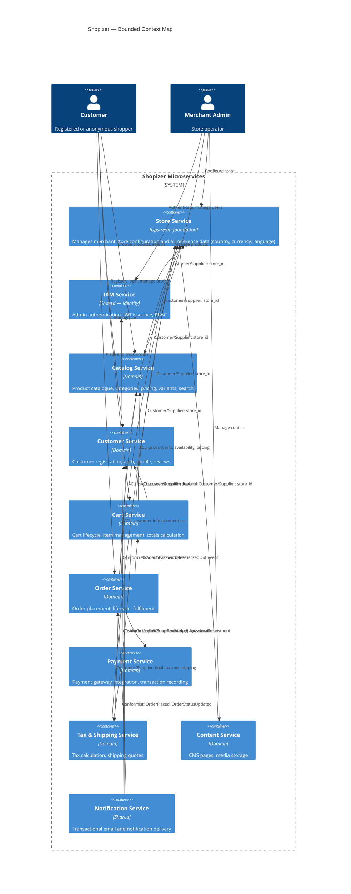

# Shopizer — Bounded Context Map

**Version:** 1.0  
**Date:** 2026-06-26  
**Evidence Source:** Neo4j graph (Queries 1, 2, 9, 11) + discovery documents  

---

## Context Map Diagram

---

## Context Relationships

### 1. Store Service — Published Language (Upstream)

**Role:** Store Service is the **upstream** anchor for the entire portfolio. Every other service holds a read-only `store_id` reference. No downstream service writes to store configuration tables.

**Relationship pattern:** Customer/Supplier for all domain services  
**Coupling score:** Very High (referenced by all 9 services)  
**Key risk:** Changes to store configuration schema require coordinated review across the portfolio.

---

### 2. IAM Service — Shared Kernel

**Role:** IAM Service holds the admin identity domain. Customer Service holds the customer identity domain. Both publish JWT tokens but for different principals (admin vs. customer). They share no database tables.

**Relationship pattern:** Shared Kernel — both services contribute to the platform's overall authentication model  
**Token validation:** All services validate JWT tokens independently (stateless); IAM Service is not in the hot path for every request.

---

### 3. Catalog Service ← Cart Service / Order Service — Anti-Corruption Layer

**Role:** Cart Service and Order Service consume product data from Catalog Service. They must NOT use Catalog's internal domain model. Both services translate incoming product data into their own local models (price snapshot in cart item, product name snapshot in order product).

**Relationship pattern:** Anti-Corruption Layer (downstream services translate Catalog concepts)  
**Key rule:** Order products store a snapshot of the product name and price at the time of order. Order Service does not query Catalog for historical order data.

---

### 4. Payment Service ← Order Service — Customer/Supplier

**Role:** Order Service is the downstream consumer of Payment Service. Payment Service exposes authorise/capture/void operations. Order Service orchestrates the payment step as part of order checkout.

**Relationship pattern:** Customer/Supplier  
**Critical finding (Query 9):** `PaymentServiceImpl` was found to straddle both Payment Processing and Order Management contexts. This must be resolved by enforcing that PaymentServiceImpl lives solely within the Payment bounded context boundary, and Order Service interacts with it only through a published API contract.

---

### 5. Cart Service → Order Service — Published Language

**Role:** When a cart is checked out, Cart Service publishes a `CartCheckedOut` event with the full cart snapshot. Order Service consumes this event to create the order. This decouples the two services.

**Relationship pattern:** Published Language (event-driven)  
**Key rule:** Cart Service does NOT call Order Service synchronously. The handoff is asynchronous via domain event.

---

### 6. Notification Service — Conformist

**Role:** Notification Service subscribes to domain events from Order, Customer, and IAM services. It does not have its own domain model beyond delivery tracking. It conforms to the event schemas published by upstream services.

**Relationship pattern:** Conformist  
**Coupling score:** Low

---

## Shared Data Risks

| Shared Table | Conflict | Resolution |
|---|---|---|
| sm_transaction | Claimed by both Order Management and Payment Processing contexts | Exclusively owned by Payment Service; Order Service reads payment status via Payment Service API only |
| CUSTOMER | Read by Order Service and Cart Service | Order and Cart store snapshots of required customer fields; live profile queries go through Customer Service API |
| PRODUCT / PRODUCT_AVAILABILITY | Read by Cart Service, Order Service | Cart and Order store price/availability snapshots at point in time; live queries go through Catalog Service API |
| MERCHANT_STORE | Referenced by all entities via merchant_id | Store Service is sole owner; all others hold store_id as a foreign reference (no joins across service boundaries) |

---

## Extraction Sequencing Summary

| Wave | Services | Rationale |
|---|---|---|
| Wave 1 (Foundation) | store-service, iam-service, content-service | Lowest dependency, fewest consumers, highest independence |
| Wave 2 (Core Catalog) | catalog-service | High read traffic; independent data; unblocks downstream |
| Wave 3 (Customer) | customer-service, notification-service | Moderate coupling; enables customer auth separation |
| Wave 4 (Commerce) | tax-shipping-service, cart-service, payment-service | Tax/shipping independent; cart and payment before order |
| Wave 5 (Orchestration) | order-service | Most coupled; extracted last after all dependencies are services |
